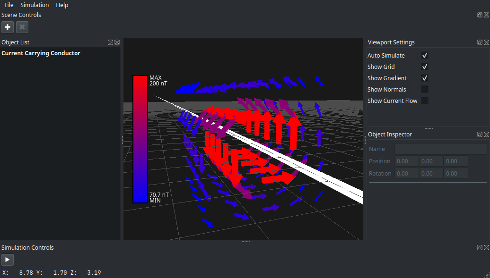
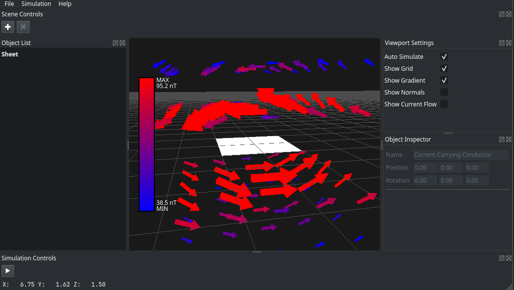

<link rel="apple-touch-icon" sizes="180x180" href="/assets/apple-touch-icon.png">
<link rel="icon" type="image/png" sizes="32x32" href="/assets/favicon-32x32.png">
<link rel="icon" type="image/png" sizes="16x16" href="/assets/favicon-16x16.png">
<link rel="manifest" href="/assets/site.webmanifest">
<link rel="mask-icon" href="/assets/safari-pinned-tab.svg" color="#5bbad5">
<link rel="shortcut icon" href="/assets/favicon.ico">
<meta name="msapplication-TileColor" content="#da532c">
<meta name="msapplication-config" content="/assets/browserconfig.xml">
<meta name="theme-color" content="#ffffff">

# MGField
MgField is a desktop application used to visualize magnetic fields of various objects. This application is mostly made for educational purposes to build intuition for people getting into electricity and magnetism
 
